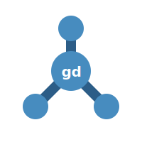

<p align="center">
  
</p>

<h1 align="center">🧩 GD — Godot Version Manager CLI</h1>

<p align="center"><b>A simple CLI for managing multiple Godot versions</b></p>

<p align="center">
GD is a command-line tool for managing multiple versions of the Godot Engine. It lets you install, switch, run, and maintain different Godot versions across projects.
</p>

## ✨ Features

- 📦 Install specific Godot versions (including release channels)
- 📋 List installed versions
- 🚀 Run Godot in GUI or console (headless) mode
- 🔁 Switch versions per project or globally
- 🧹 Remove installed versions
- ⚙️ Repair configuration files
- ♻ Restore environments from configuration

---

## 🚀 Usage

```
gd [command] [arguments] [options]
```

---

## 📚 Commands

### 📋 `list`

Displays all installed Godot versions.

```
gd list [--mono]
```

**Options:**

- `--mono`  
  Show only .NET (Mono) builds

---

### 🚀 `run`

Launches the Godot engine.

```
gd run [version] [options]
```

**Arguments:**

- `version` *(optional)*  
  Version to run. If omitted, the default version is used.

**Options:**

- `-c, --console`  
  Run in console (headless) mode  
- `-m, --mono`  
  Use the .NET (Mono) build  

---

### 🔁 `use`

Sets the default Godot version.

```
gd use [version] [options]
```

**Arguments:**

- `version`  
  Version to use

**Options:**

- `--global`  
  Set as the global default version  
- `--console`  
  Use console mode by default  
- `--mono`  
  Use the .NET (Mono) build  

---

### 📦 `install`

Downloads and installs a specific version of Godot.

```
gd install [version] [options]
```

**Arguments:**

- `version`  
  Version to install

**Options:**

- `-c, --channel <CHANNEL>`  
  Install from a specific release channel (e.g. `stable`, `beta`, `dev`)  
- `--mono`, `--dotnet`  
  Install the .NET (Mono) build  

---

### 🧹 `remove`

Uninstalls a specific Godot version.

```
gd remove [version] [options]
```

**Arguments:**

- `version`  
  Version to remove

**Options:**

- `--mono`  
  Remove the .NET (Mono) build  

---

### ⚙️ `config repair`

Repairs GD configuration files.

```
gd config repair
```

---

### ♻ `restore`

Restores and installs versions defined in configuration files.

```
gd restore
```

---

### 🔄 `reset`

Resets GD configuration and internal state.

```
gd reset
```

---

## ⚙️ Configuration

GD maintains configuration files to track:

- Installed Godot versions  
- Default version (global and per-project)  
- Runtime preferences (console mode, Mono usage)  

Configuration changes are automatically saved when necessary.

---

## 🧠 Behavior

- If no version is specified, GD uses the current default version
- Local project configuration overrides global settings
- Supports both standard and .NET (Mono) builds of Godot
- Gracefully handles interruptions (`Ctrl + C`)

---

## ❗ Exit Codes

GD returns structured exit codes for better scripting and automation:

| Code | Meaning              |
|------|---------------------|
| 1    | Invalid arguments   |
| 2    | Not found           |
| 3    | Network error       |
| 4    | Permission denied   |
| 5    | Unknown error       |

---

## 💡 Example Workflows

### Install and use a version

```
gd install 4.2.1
gd use 4.2.1
gd run
```

### Use a version for a specific project

```
cd my-project
gd use 4.1.3
```

### Run a specific version without switching

```
gd run 4.0.4 --console
```

### Restore environment from config

```
gd restore
```

---

## 🤝 Contributing

Contributions, suggestions, and feedback are welcome.

---

## 📄 License

MIT License (or your preferred license)
